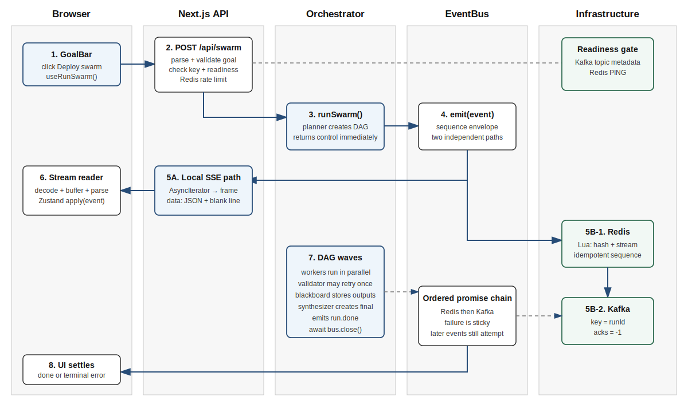
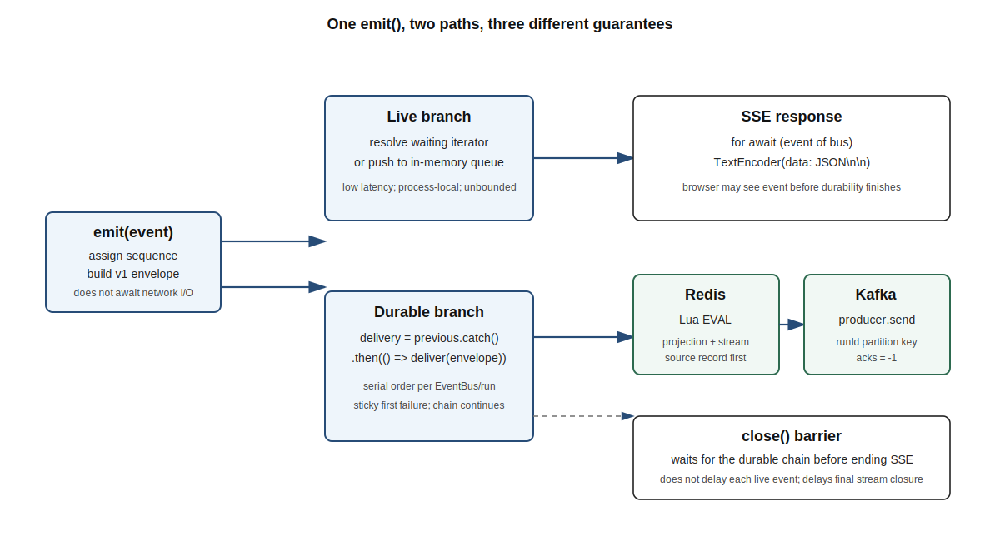
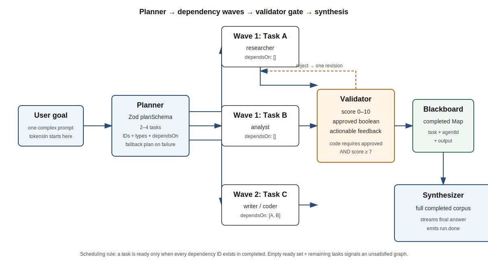
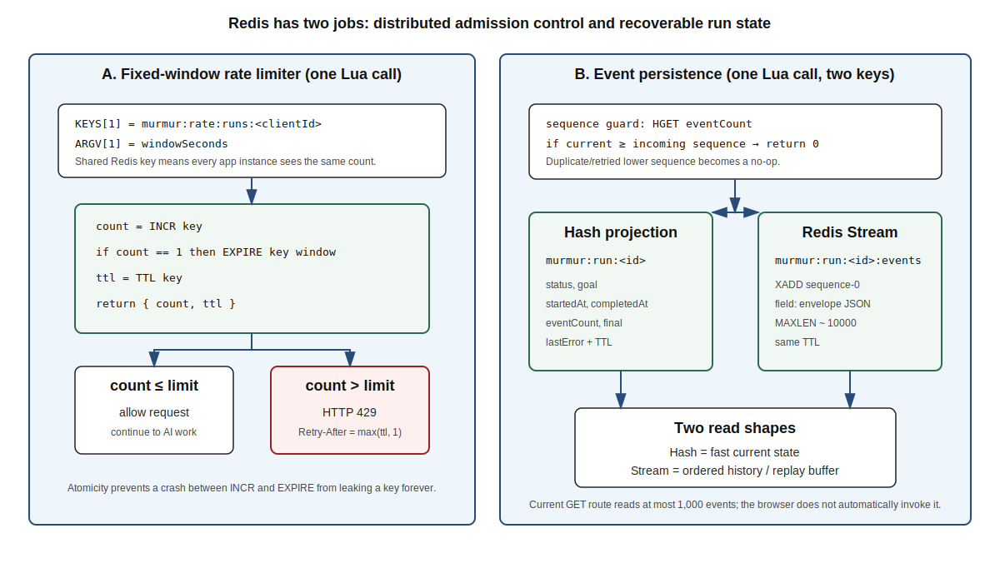
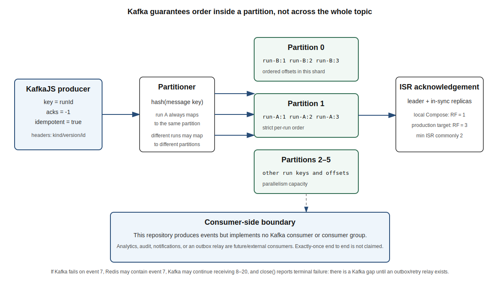
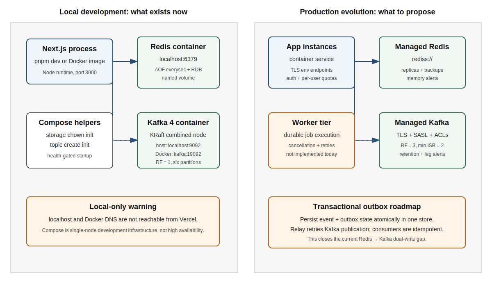

<div class="page-break"></div>

# How to use this book

This is not a generic Kafka, Redis, or Next.js book. It is a placement handbook built around the code that actually exists in Murmur. Use it in three passes:

1. **Pass 1 — Speak:** Memorise the 30-second and two-minute project introductions, the twelve-step flow, and the “why this, why not that” answers.
2. **Pass 2 — Defend:** Read each module with the repository open. Trace the named file and explain each hard line in your own words.
3. **Pass 3 — Stress:** Answer the failure drills and senior follow-ups without looking. A senior interviewer usually tests guarantees, failure modes, scale, and trade-offs after the basic explanation.

The book uses four truth labels:

| Label | Meaning |
|---|---|
| **Implemented** | Present and exercised by the current repository code. |
| **Configured locally** | Present in Docker/Compose or configuration, but not necessarily production-grade. |
| **Not implemented** | A useful idea or interview upgrade that does not exist in the repository. Say this honestly. |
| **Production target** | A recommended design for scale, reliability, or security. |

> **Accuracy rule:** Never present a production target as implemented. Interviewers reward honest boundaries more than inflated claims.

## Seven-day preparation route

| Day | Modules | Output you should produce |
|---|---|---|
| 1 | 1–2 | Deliver the project introduction and draw the architecture from memory. |
| 2 | 3–6 | Explain the complete browser/SSE/Zustand/React Flow path. |
| 3 | 7–9 | Explain API gates, EventBus, and DAG scheduling line by line. |
| 4 | 10–12 | Defend AI SDK/Zod, both Redis Lua scripts, and Kafka semantics. |
| 5 | 13–15 | Explain Docker/Compose, failures, testing, security, and scaling. |
| 6 | 16–17 | Drill cliché questions and senior failure scenarios. |
| 7 | 18 | Run the mock interview and use the last-day revision sheet only. |

# Part I — Interview opening and system map

# Module 1 — How to introduce Murmur

## One-line resume description

> Murmur is a real-time multi-agent orchestration system that converts a user goal into a validated task DAG, runs independent AI workers concurrently, streams their progress to a React graph over SSE, and records every event in Redis and Kafka.

## Thirty-second introduction

> I built Murmur to make multi-agent execution observable and structured instead of hiding everything behind one LLM response. A Next.js route validates the request and checks required Kafka and Redis infrastructure before spending model tokens. A planner returns a Zod-validated task DAG. The orchestrator executes ready tasks in parallel, validates each result, retries once with feedback, and synthesizes a final answer. A custom EventBus sends each event immediately to the browser over SSE while serialising a second Redis-then-Kafka durability path. Redis also provides distributed rate limits and replayable run state. Docker Compose provisions the local Kafka and Redis stack.

## Two-minute introduction

> The user starts from a React client component. `useRunSwarm` aborts the previous browser request, resets the Zustand store, and POSTs the goal to `/api/swarm`. The route performs cheap gates first: body validation, API-key validation, a cached readiness probe against the Kafka topic and Redis, then an atomic Redis rate-limit check. Only after those gates pass does it create a run ID and one EventBus.
>
> The planner uses the Vercel AI SDK with a Zod schema to create a two-to-four-task DAG. The orchestrator keeps `remaining` and `completed` maps. A task is ready when all its dependency IDs exist in `completed`, so independent tasks form a wave and run concurrently with `Promise.all`. Their outputs become a shared blackboard for dependent workers. A validator returns a score, approval flag, and feedback. Code requires both approval and a score of at least seven, with one feedback-based revision. The synthesizer then combines the completed corpus.
>
> Every state change is a discriminated-union event. The EventBus has a low-latency local branch and an ordered durable branch. The local branch feeds an `AsyncIterable` consumed by a `ReadableStream`; the route encodes `data: JSON\n\n` SSE frames. The browser decodes chunks, buffers incomplete frames, parses events, and applies them to Zustand, which drives React Flow nodes and edges. Separately, the durable branch writes an idempotent sequence to a Redis hash and Redis Stream through Lua, then publishes the same versioned envelope to Kafka using `runId` as the key and `acks=-1`. Closing the bus waits for pending durable delivery before ending the SSE response.
>
> The honest limitations are important: the orchestration still runs inside the HTTP invocation, there is no Kafka consumer in this repository, the browser does not yet call the replay route automatically, and Redis plus Kafka do not share a transaction. My scale-up design would add a durable worker, cancellation propagation, authentication, observability, and a transactional-outbox relay.

## Why this project is technically interesting

Murmur combines five engineering problems in one traceable project:

- **Graph scheduling:** execute tasks according to dependencies, not a fixed list.
- **Runtime AI contracts:** convert probabilistic LLM output into validated objects.
- **Live transport:** stream partial work without waiting for the final result.
- **Distributed state:** enforce quotas and preserve run history across app instances.
- **Delivery semantics:** reason about order, acknowledgement, idempotence, and dual-write failure.

## Ownership answer template

Use this structure and replace only with facts you personally did:

> My main contribution was **[specific module/change]**. The difficult part was **[failure or trade-off]**. I chose **[design]** because **[reason]**. I verified it with **[build/test/health check]**. The remaining risk is **[honest limitation]**, and I would address it with **[next design]**.

Do not invent traffic numbers, latency improvements, users, or cost savings. This repository does not contain production telemetry proving those metrics.

## Typical opening follow-ups

**Why is this a swarm instead of one prompt?**  
One model call is simpler and cheaper. A swarm is justified when the task benefits from decomposition, parallel specialist work, explicit dependencies, validation, and visible progress. Murmur pays extra model and coordination cost to gain those properties.

**What was the hardest part?**  
The hardest part is not calling an LLM. It is preserving understandable state across concurrent workers while giving the browser immediate progress and keeping an ordered recoverable event record.

**What is your strongest production decision?**  
Rejecting requests before model spend when required infrastructure is unavailable, and making Redis rate-limit updates atomic with Lua.

**What is the biggest weakness?**  
Execution is tied to the request lifecycle and Redis-to-Kafka is a dual write without an outbox. State this before the interviewer discovers it.

# Module 2 — Stack map and complete architecture

## Stack at a glance

| Layer | Technology | Exact role in Murmur | Current boundary |
|---|---|---|---|
| Language | TypeScript 5 | Domain types, event union, utility types, generics, narrowing | Compile-time only; runtime input still needs validation |
| Framework | Next.js 16 App Router | React app plus Node route handlers | Long execution remains inside one route invocation |
| UI | React 19 | Client components, hooks, rendering | No error boundary or automated replay UI |
| State | Zustand 5 | One event reducer updates graph state | Saved history is browser `localStorage` |
| Graph | React Flow 11 (`reactflow`) | Agent nodes, message/dependency edges, layout | Layout is a custom longest-path approximation |
| Live transport | Fetch + Web Streams + SSE framing | Server-to-browser token/event delivery | Manual parser; not native `EventSource` |
| AI runtime | Vercel AI SDK 6 | `streamText`, `streamObject`, `generateObject` | The last two are deprecated in AI SDK 6 |
| AI provider | OpenRouter | One key, role-based model chains and paid-tier probe | Free model availability/rate limits are unstable |
| Runtime contracts | Zod 4 | Planner and validator object schemas | Does not validate the entire DAG graph semantics |
| In-process bus | Custom `EventBus` | Local async queue plus ordered delivery chain | Process-local and unbounded |
| Shared state | Redis 8 + ioredis | Rate limits, run hash, Redis Stream replay buffer | Single-node Compose locally; GET returns max 1,000 events by default |
| Distributed log | Apache Kafka 4 + KafkaJS | Versioned event publication keyed by run ID | Producer only; no consumer in this repository |
| Local infrastructure | Docker + Compose | Kafka KRaft node, topic init, Redis persistence | Development stack, not high availability |
| Production image | Multi-stage Dockerfile | Standalone Next.js server running as non-root | No CI/CD pipeline or orchestrator manifest in repo |



## The correct twelve-step narrative

1. `GoalBar` calls the `useRunSwarm` hook with a trimmed goal.
2. The hook aborts the previous browser fetch, creates a new `AbortController`, resets Zustand, and POSTs JSON.
3. `/api/swarm` parses defensively and rejects an invalid goal with HTTP 400.
4. The route rejects a missing server-side OpenRouter key with HTTP 500.
5. It checks Kafka topic metadata and Redis `PING` concurrently through a five-second health cache. Failure returns HTTP 503 before model spend.
6. A Redis Lua script performs the distributed run-rate check. Exceeding the count returns HTTP 429 plus `Retry-After`.
7. The route creates a UUID run ID and one EventBus, starts `runSwarm` without awaiting it, and returns a streaming response.
8. The planner attempts a Zod-structured DAG; on any planner failure it currently falls back to a generic two-task plan.
9. The orchestrator executes ready DAG waves, validates each worker, optionally retries once, then synthesizes a final answer.
10. Each `emit` immediately hands the plain event to the local SSE queue and independently appends a versioned envelope to an ordered delivery chain.
11. The durable chain writes Redis first, then Kafka. `close()` waits for the chain before the iterator terminates. **The browser can still receive `run.done` before its remote write finishes; only stream closure waits.**
12. The browser parses frames and updates Zustand. The replay GET route exists, but the current browser does **not** automatically call it after reload or disconnect.

## Control flow, data flow, and event flow

| Flow | Question it answers | Murmur example |
|---|---|---|
| Control flow | “What code runs next?” | Route gates → planner → DAG loop → synthesis → close |
| Data flow | “Where does information move?” | Goal → plan → dependency outputs → final corpus |
| Event flow | “How do observers learn state changed?” | `agent.token` → EventBus → SSE/Redis/Kafka |

## Implemented guarantee matrix

| Claim | Actual guarantee |
|---|---|
| Browser event order | One EventBus iterator observes synchronous `emit` call order for that run. |
| Redis event order | Promise chain serialises writes; Lua rejects duplicate/lower sequence numbers. |
| Kafka event order | The producer sends one run ID key, so events for that run target one partition. Ordering remains partition-scoped. |
| Durable before UI | **Not guaranteed.** Live branch is immediate; durable branch is asynchronous. |
| Durable before response ends | Intended: `close()` waits for the delivery chain before resolving the iterator. |
| Exactly once | **Not guaranteed end to end.** Redis and Kafka have no shared transaction, and no consumer semantics are implemented. |
| Resume after reload | Backend data exists; browser integration is **not implemented**. |
| Backend cancellation | **Not implemented.** Aborting browser fetch does not propagate its signal into model calls. |

# Part II — Frontend modules

# Module 3 — React and Next.js client boundaries

## Files to know

- `src/app/page.tsx`: server-rendered composition of the main screen.
- `src/components/GoalBar.tsx`: client form, examples, busy-state guard.
- `src/lib/useRunSwarm.ts`: client networking and SSE parsing.
- `src/lib/store.ts`: global event-driven UI state.
- `src/components/SwarmGraph.tsx`: graph projection.
- `src/components/SidePanel.tsx`: selected-agent/final-output view.
- `src/components/RecentRuns.tsx`: `localStorage` history.

## What `"use client"` means here

A file with `"use client"` is a client-component boundary. It can use browser-only state, effects, event handlers, `localStorage`, and hooks. `GoalBar`, the graph, side panel, recent runs, and `useRunSwarm` need that boundary. The API routes, Kafka, Redis, OpenRouter key, and orchestration stay server-side.

**Interview answer:**

> I keep secrets and raw infrastructure clients on the server. Client components own interaction and presentation. This avoids shipping server credentials or TCP-dependent libraries to the browser bundle.

## `GoalBar` execution in plain English

```ts
const submit = (g: string) => {
  const v = g.trim();
  if (v.length < 4 || busy) return;
  setGoal(v);
  run(v);
};
```

| Code | Meaning | Bug prevented |
|---|---|---|
| `trim()` | removes surrounding whitespace | a goal of spaces passing length checks |
| `busy` | true while store status is `running` | duplicate clicks creating concurrent expensive runs |
| `return` | stops this function immediately | work continuing after an invalid condition |
| `run(v)` | invokes the custom networking hook | centralises stream handling outside the component |

The server repeats validation because browser validation is a convenience, not a security boundary. A malicious caller can skip the React UI.

## Cliché questions — React/client boundary

**Why React?**  
Murmur has rapidly changing, component-shaped UI state: nodes, edges, selected output, statuses, and token text. React maps state changes to declarative views well.

**Why Next.js instead of separate React and Express apps?**  
For this project, one repository and deployable can host the React UI and server route handlers with server-only environment variables. At high scale, splitting the worker/API tier could become cleaner.

**Why not put OpenRouter calls directly in the browser?**  
It would expose the API key, make quotas easier to abuse, and prevent centralised infrastructure checks, rate limiting, and event durability.

**What causes a re-render?**  
State selected from Zustand changes. Components using broad selectors re-render on more changes than components selecting one narrow slice.

**Current optimisation concern?**  
`SidePanel` calls `useSwarm()` without a selector, subscribing to the whole store. Token events are frequent, so narrow selectors could reduce unnecessary re-renders.

# Module 4 — Fetch, Web Streams, SSE framing, and aborts

## Why this is SSE-like streaming over fetch

The route returns `content-type: text/event-stream` and frames each event as:

```text
data: {"kind":"agent.status","id":"agent-t1","status":"streaming"}

```

The blank line terminates one SSE message. The client uses `fetch` and a `ReadableStream` reader rather than the browser’s `EventSource` API because the run starts with a POST body. Native `EventSource` is GET-oriented and offers less request control.

## Server encoding path

```ts
controller.enqueue(
  encoder.encode(`data: ${JSON.stringify(event)}\n\n`),
);
```

1. The event is a JavaScript object.
2. `JSON.stringify` converts it to text.
3. `data: ` and `\n\n` form one SSE frame.
4. `TextEncoder` converts text to UTF-8 bytes.
5. `enqueue` places those bytes into the HTTP response stream.

## Client parser line by line

```ts
buffer += decoder.decode(value, { stream: true });
const chunks = buffer.split("\n\n");
buffer = chunks.pop() ?? "";
```

- Network chunks are arbitrary. One chunk may contain half an event, three events, or half a UTF-8 character.
- `{ stream: true }` tells the decoder to retain incomplete byte sequences for the next call.
- Splitting on the blank-line delimiter finds complete candidate frames.
- `pop()` removes the last piece because it may be incomplete; that piece stays in `buffer`.
- Each complete `data:` payload is parsed and passed to `apply(event)`.

This follows the Web Streams and streaming decoder model documented by MDN ([R7]).

## What `AbortController` actually guarantees

```ts
abortRef.current?.abort();
const ctrl = new AbortController();
abortRef.current = ctrl;
fetch(url, { signal: ctrl.signal });
```

**Implemented:** the previous browser request is cancelled and its response is no longer read.

**Not implemented:** that signal is not sent into `/api/swarm`, stored on the EventBus, or combined with the model `AbortSignal.timeout`. The server-side orchestration may continue. A placement answer must distinguish client cancellation from job cancellation.

## SSE versus alternatives

| Transport | Strength | Weakness | Fit here |
|---|---|---|---|
| SSE | Simple server→client stream over HTTP; text framing | one-way; reconnect/replay needs design | Best current fit |
| WebSocket | Full duplex, low-overhead repeated messages | connection state, upgrades, scaling complexity | Unneeded unless user sends live control/cancel messages |
| Long polling | Works almost everywhere | repeated requests and latency | Simpler fallback, worse experience |
| Polling GET | Easy operational model | not truly live; repeated load | Good for coarse job status, not tokens |
| Webhook | Server pushes to another server | not a browser live UI | Good for external completion notifications |

## Cliché questions — streaming

**Why SSE and not WebSocket?**  
The dominant flow is server-to-browser. SSE keeps the operational model HTTP-native. WebSocket is justified if the product needs bidirectional control, collaborative presence, or many client messages.

**Does SSE guarantee delivery?**  
No. The TCP/HTTP connection gives ordered bytes while connected, but the application needs event IDs, persistence, and replay for reconnect reliability.

**What if a proxy buffers the response?**  
The UI stops appearing live. `cache-control: no-cache, no-transform` helps, but deployment-specific proxy buffering must also be checked.

**What is backpressure here?**  
If the consumer reads slower than producers emit, the EventBus array can grow without a bound. There is no explicit high-water mark or token coalescing.

**How would you optimise token streaming?**  
Batch small deltas for 20–50 ms, emit larger chunks, cap queue size, measure delivery lag, and avoid one Redis plus Kafka round-trip per tiny token delta at large scale.

# Module 5 — Zustand as an event reducer

## Mental model

Zustand holds the browser’s projection of a run. The backend emits facts; `apply(event)` reduces each fact into current UI state.

```text
event history → reducer → current graph projection
```

This resembles event sourcing conceptually, but browser state is not the source of truth. It is a temporary projection and selected completed runs are copied to `localStorage`.

## Discriminated union makes the switch safe

```ts
export type SwarmEvent =
  | { kind: "plan.done"; plan: SwarmPlan }
  | { kind: "agent.token"; id: string; delta: string }
  | { kind: "run.done"; final: string; tokensIn: number; tokensOut: number; ms: number }
  | { kind: "error"; message: string; agentId?: string };
```

Inside `case "agent.token"`, TypeScript knows `id` and `delta` exist. This is discriminated-union narrowing ([R8]). TypeScript provides compile-time safety; it does not validate untrusted JSON at runtime.

## Important state transitions

| Event | UI effect |
|---|---|
| `plan.token` | appends planner-visible text |
| `plan.done` | stores summary and marks planner done |
| `agent.spawn` | creates a node and dependency/assignment edges |
| `agent.status` | changes badge/status animation |
| `agent.token` | appends streamed output |
| `message` | adds validator review/revision edge only |
| `validate.result` | stores score and feedback |
| `run.done` | stores final/statistics and writes recent history |
| `error` | marks the whole UI status as error |

## Current correctness and performance observations

- `message` events between ordinary workers are ignored by the store; dependency edges mostly come from `agent.spawn`.
- Every token copies the agent object and parent `agents` record. This is clear but can become expensive for very long output.
- `saveRun` occurs when `run.done` reaches the live branch, potentially before durable Redis/Kafka completion.
- `localStorage` history is device/browser-specific and capped at 25 runs. It is not authentication-aware server history.
- JSON parsed from SSE is asserted as `SwarmEvent` rather than runtime-validated. A schema/version check would harden compatibility.

## Cliché questions — Zustand

**Why Zustand instead of Redux?**  
The project needs one compact store and direct actions without Redux ceremony. Redux would bring stronger conventions and middleware/devtools patterns that become valuable in a larger team or complex state domain.

**Why not React Context?**  
Context can work, but frequent token updates can re-render broad consumers unless the state is split carefully. Selector-based external stores make granular subscriptions easier.

**Why not keep state inside `SwarmGraph`?**  
The graph, side panel, goal bar, and recent-runs panel all consume related run state. A shared store avoids prop drilling and competing copies.

**How would you test it?**  
Feed a deterministic event sequence to the store and assert the resulting nodes, edges, output, run status, and saved history. Also test out-of-order or unknown events.

# Module 6 — React Flow graph rendering

## How domain state becomes a graph

`SwarmGraph` maps `AgentNode` objects to React Flow nodes and `SwarmEdge` objects to React Flow edges. A custom `AgentFlowNode` renders role, title, status, preview, and validator score.

The layout computes a depth for each node:

```ts
depth[id] = deps.length ? 1 + Math.max(...deps.map(get)) : 1;
```

Plain English: a worker with no dependencies is placed at depth one. A dependent worker is placed one column after its deepest dependency. This is a longest-path layering heuristic for a DAG.

## Why `useMemo` is used

Node positions, React Flow node objects, and edges are derived calculations. `useMemo` reuses a prior result until its dependencies change. React documents it as a performance optimisation, not a semantic guarantee ([R9]).

## Current graph limitations

- The recursive layout has no cycle guard; the backend tries to detect an unsatisfied graph later, but a bad loaded graph could recurse badly in the client.
- Validator placement is fixed to the right rather than computed from review edges.
- Nodes are draggable, but moved positions are not persisted because the component supplies freshly derived positions.
- The graph subscribes separately to several store slices, which is preferable to subscribing to the entire store.
- React Flow itself recommends selector-based state management for node/edge applications ([R10]).

## Cliché questions — graph UI

**Why React Flow?**  
It provides tested pan/zoom, nodes, handles, edges, markers, and interactions. Building those correctly from raw SVG/canvas would consume time unrelated to Murmur’s orchestration problem.

**Why not render a normal list?**  
A list is simpler, but it hides dependency structure and parallel waves. The graph makes the DAG and validator messages inspectable.

**How would you support 10,000 nodes?**  
Do not render them all as rich DOM nodes. Aggregate/collapse groups, virtualise surrounding panels, reduce labels/animation, use viewport culling, and consider canvas/WebGL rendering.

**What is the graph’s source of truth?**  
The Zustand projection built from backend events. React Flow is the visual renderer, not the orchestration engine.

<div class="page-break"></div>

# Part III — Backend modules

# Module 7 — Next.js route handlers, gates, and readiness

## The three API routes

| Method | Route | Purpose | Success | Main failures |
|---|---|---|---|---|
| `POST` | `/api/swarm` | Start a run and stream live events | `200` SSE, `x-murmur-run-id` | `400`, `429`, `500`, `503` |
| `GET` | `/api/swarm/[runId]` | Read a Redis session and up to 1,000 events | `200` JSON | `400`, `404`, `503` |
| `GET` | `/api/health` | Force a fresh Redis/Kafka readiness probe | `200` ready | `503` not ready |

Next.js Route Handlers use the Web `Request` and `Response` APIs inside the `app` directory ([R1]). Murmur explicitly selects the Node runtime because ioredis and KafkaJS need ordinary network sockets. The Edge runtime supports a more restricted API surface and does not support all Node APIs ([R2]).

## Why the POST gates are in this order

```text
parse → validate goal → check API key → check infrastructure → rate limit → create run
```

The ordering is a cost and failure-isolation decision:

1. Parsing and string validation are local and cheapest.
2. Checking an environment variable costs almost nothing.
3. Readiness prevents model work when required durability is unavailable.
4. The distributed rate limit protects cost and capacity.
5. Only then does the route allocate a run and invoke the AI pipeline.

This is **fail-closed** behavior: when Redis, Kafka, or the rate limiter cannot prove the request is allowed, Murmur refuses new work. That improves cost and consistency at the expense of availability.

## Defensive JSON parsing

```ts
const { goal } = await req.json().catch(() => ({ goal: "" }));
if (!goal || typeof goal !== "string" || goal.trim().length < 4) {
  return new Response(..., { status: 400 });
}
```

`req.json()` can reject when the body is malformed. The `catch` turns that transport-level problem into an empty value so one validation branch returns a stable client error. The server checks the type because a caller can submit `{"goal": 42}` without using the UI.

**Hardening opportunity:** use a request Zod schema and enforce a maximum goal length. The current code prevents a too-short goal but does not bound prompt size.

## Infrastructure readiness and the five-second cache

```ts
inFlight = Promise.all([
  checkDependency(pingKafka),
  checkDependency(pingRedis),
]).then(([kafka, redis]) => { ... });
```

- `Promise.all` starts both independent probes together, so total latency is approximately the slower probe rather than their sum.
- `cached` reuses a result briefly, avoiding a Kafka admin connection for every incoming run.
- `inFlight` deduplicates simultaneous callers: ten requests arriving together share one active probe.
- Kafka readiness checks topic metadata, not only broker reachability. “The port accepts connections” does not prove the required topic is usable.
- `/api/health` passes `force: true`, uses `dynamic = "force-dynamic"`, and returns `cache-control: no-store` so an orchestrator receives a fresh readiness result.

Readiness means “can this instance serve its contract now?” Liveness means “is the process alive?” The Docker health check currently uses readiness. Therefore a temporary Kafka outage can mark the app container unhealthy even though its Node process is alive. In Kubernetes, these would normally be separate probes.

## Client identity and proxy trust

The rate-limit identity uses the first `x-forwarded-for` value, then `x-real-ip`, then `local`. This is acceptable only when a trusted reverse proxy overwrites those headers. If clients can reach the app directly and supply arbitrary forwarding headers, they can rotate the value and bypass the limit.

**Production target:** authenticate users, rate-limit by user/account/API key, configure trusted proxy hops, and use IP only as an additional abuse signal.

## Why `runSwarm` is not awaited

```ts
runSwarm(goal.trim(), bus).catch(...);
return new Response(stream, { headers: ... });
```

Awaiting `runSwarm` before returning would buffer the whole run and defeat live streaming. Starting it first lets the stream reader and producers progress concurrently in the same process. This is not the same as a durable background job: if the process or serverless invocation dies, execution dies too.

## Replay route details

Dynamic route parameters are promises in current Next.js and are awaited ([R3]). The route reads a Redis hash projection plus `XRANGE` from the event stream.

Current limits to state honestly:

- The UUID regex checks length and allowed characters but is looser than a canonical UUID parser.
- The reader returns at most 1,000 events by default even though Redis retains approximately 10,000.
- There is no pagination or `afterSequence` cursor.
- The frontend does not call this route automatically.
- The route has no authorization, so knowing a run ID is enough to request it.

## Cliché questions — API and readiness

**Why Node runtime, not Edge?**  
The infrastructure libraries require Node-compatible TCP networking. Edge is useful for lightweight geographically distributed fetch-based logic, not this Kafka/Redis orchestration path.

**Why return 503 when Kafka is down?**  
Kafka is declared part of the run contract. Accepting work would falsely imply durable publication. If Kafka were optional analytics, a buffered best-effort design could choose availability instead.

**Why cache readiness?**  
An admin metadata probe per user request is wasteful. A short cache reduces dependency load while bounding stale health information.

**Why 429 instead of 403?**  
The request is valid but temporarily exceeds a quota. `Retry-After` tells a compliant client when to try again.

**Why not return internal dependency errors from `/api/health`?**  
Raw broker names, credentials, or network details can leak topology. The public response exposes status and latency; detailed errors belong in protected logs.

**What happens in serverless hosting?**  
Long streams face duration and lifecycle limits. `maxDuration = 300` is only a platform hint, not a universal guarantee. A durable job queue plus a separate stream gateway is safer.

# Module 8 — EventBus, `AsyncIterable`, ordering, and dual delivery



## What the EventBus is and is not

The EventBus is an in-memory queue for one run. Many async producers call `emit`; one SSE loop consumes events with `for await`. It also schedules remote delivery. It is **not Kafka**, not shared across app instances, not persistent, and not a general pub/sub broker.

## The two branches of `emit`

```ts
this.delivery = this.delivery
  .catch(() => undefined)
  .then(() => this.deliver(envelope));

const waiter = this.waiters.shift();
if (waiter) waiter.resolve({ value: event, done: false });
else this.queue.push(event);
```

### Branch A — live delivery

If the SSE reader is waiting, `emit` resolves it immediately. Otherwise it stores the plain event in `queue`. There is no Redis/Kafka await on this branch, keeping UI latency low.

### Branch B — durable delivery

`delivery` is reassigned to a new promise whose callback runs after the previous delivery settles. That serialises remote writes in emission order without blocking producers.

The mid-chain `.catch(() => undefined)` is crucial. A rejected promise normally causes later `.then` callbacks to be skipped. Recovering before appending the next callback keeps later delivery attempts alive. The first error is still remembered in `deliveryFailure`, so recovery here does not hide the terminal failure.

## Versioned event envelope

```ts
{
  version: 1,
  id: `${runId}:${sequence}`,
  runId,
  sequence,
  occurredAt: Date.now(),
  event
}
```

| Field | Reason |
|---|---|
| `version` | permits future schema evolution |
| `id` | stable event identity for deduplication/tracing |
| `runId` | correlation and Kafka partition key |
| `sequence` | per-run ordering and replay guard |
| `occurredAt` | event time, distinct from consumer processing time |
| `event` | discriminated domain payload |

The sequence is process-local and starts at one for a new EventBus. It is suitable for this single-owner run model. It would need coordination if multiple processes could emit into the same run.

## `AsyncIterable` in simple words

An async iterator answers repeated “give me the next value” requests with promises:

- queue non-empty → return the oldest event now;
- bus closed → return `{done: true}` or reject with terminal error;
- nothing available → save the reader’s promise in `waiters` until a producer emits.

This lets ordinary language syntax consume an asynchronous queue:

```ts
for await (const event of bus) {
  send(event);
}
```

## What `close()` guarantees

1. New emits are ignored because `closing = true`.
2. It awaits the current delivery chain.
3. It marks the Redis session completed/failed.
4. It wakes waiting SSE readers as done, or rejects them on terminal durability failure.

It does **not** delay individual live events until they are durable. Consequently the browser can see an event, including `run.done`, before its Redis/Kafka write completes. The stream remains open until delivery settles.

## Event number 7 of 20 fails in Kafka — exact walkthrough

Assume Redis for event 7 succeeds, Kafka for event 7 fails:

1. The browser may already have seen event 7.
2. Redis contains event 7 because Redis is written first.
3. `deliveryFailure` records the first Kafka error.
4. The promise returned by `deliver` resolves because `deliver` catches internally; events 8–20 are still attempted in order.
5. Kafka may therefore contain 1–6 and some/all of 8–20, leaving a gap.
6. At `close`, the bus sees `deliveryFailure`, marks the Redis session failed, and throws.
7. The SSE iterator rejects; the route emits a terminal `error` frame and closes.

This is neither atomic dual-write nor end-to-end exactly-once. A consumer should detect sequence gaps and reconcile from Redis, or production should use an outbox relay.

## Backpressure and memory

The queue has no maximum size. If model/event production outpaces the browser, memory grows. The delivery chain also schedules one remote operation per emitted token. Production options:

- coalesce token deltas into time/size batches;
- set queue/event count limits;
- pause producers when a high-water mark is reached;
- move durable events through an outbox/worker;
- expose delivery lag and queue depth metrics;
- disconnect or degrade slow consumers.

## Cliché questions — EventBus

**Why build an EventBus instead of writing directly to the stream?**  
It decouples concurrent producers from the single HTTP consumer and centralises sequencing/durability. Direct writes from every worker would spread lifecycle and ordering logic across modules.

**Why not use Kafka itself to feed SSE?**  
That is a valid scale design, but it needs a consumer, offset/replay strategy, run subscription routing, and extra latency. The current local bus is simpler for one process and one active browser.

**Is JavaScript single-threaded enough to prevent races?**  
Synchronous `emit` calls run to completion one at a time on an event loop, so sequence increments are ordered in one process. Races still exist across awaits, processes, and remote systems.

**Why Redis first, Kafka second?**  
Redis is chosen as the replay source. If Kafka fails, the source event remains recoverable. The reverse order could publish an event that the replay API cannot find.

**Why not `Promise.all([redis, kafka])`?**  
It lowers latency but removes the deliberate canonical-first order and still does not create atomicity.

**How do you make the dual write correct?**  
Write state and an outbox item atomically in one database, then let a relay publish outbox items to Kafka and mark them sent. Consumers remain idempotent because relay retries can duplicate messages.

# Module 9 — DAG orchestration, parallel waves, blackboard, and validation



## The scheduler’s two maps

```ts
const completed = new Map<string, Done>();
const remaining = new Map(plan.tasks.map(t => [t.id, t]));
```

- `remaining` is the worklist.
- `completed` is both completion tracking and a **blackboard**: downstream tasks read upstream output from it.

The readiness rule is:

```ts
const ready = () => [...remaining.values()].filter(
  task => task.dependsOn.every(id => completed.has(id)),
);
```

In words: select every unstarted task whose every dependency has completed. Remove that wave from `remaining`, execute it with `Promise.all`, then repeat. This is a compact form of topological execution.

## Example wave calculation

```text
t1 research ─┐
             ├→ t3 compare → t4 write
t2 benchmark ┘
```

- Wave 1: `t1`, `t2` run concurrently.
- Wave 2: `t3` receives both outputs.
- Wave 3: `t4` receives `t3`.

If each task takes ten seconds, serial time is about forty seconds while wave time is about thirty seconds. Actual gains depend on the critical path, model concurrency, provider limits, and prompt size.

## Unsatisfiable graph detection

If `remaining.size > 0` but `ready()` is empty, the graph contains a cycle or references a missing dependency. The code emits an error and breaks. Zod validates the **shape** of each task but not graph-wide semantics such as unique IDs, dependency existence, self-dependencies, or acyclicity.

**Production target:** run a deterministic DAG validator immediately after planning. Reject duplicate IDs and unknown dependencies, then use Kahn’s algorithm to prove all nodes can be topologically sorted before spawning workers.

## Worker failure and degraded completion

When a worker exhausts its model chain, Murmur emits failed status and stores `"(this subtask failed)"` in `completed`. Dependents can proceed and synthesis still runs.

This is an availability-over-quality decision. It should be visible as `degraded`, not indistinguishable from `completed`. Critical workflows may instead stop the DAG or skip only descendants of the failed task.

## Validator loop — actual code behavior

```ts
for (let attempt = 0; attempt <= 1; attempt++) {
  const verdict = await validate(task, output);
  if (verdict.approved || attempt === 1) break;
  output = await runWorker(..., verdict.feedback);
}
```

- First verdict approved → accept.
- First verdict rejected → rerun once with feedback.
- Second verdict rejected → the loop still exits and marks the worker `done`.

Therefore “validator-gated quality” is not a strict rejection gate after the retry. The final rejected output can continue. This is useful for bounded latency but should be described as **one revision attempt**, not guaranteed approval.

The validator function itself catches total model failure and returns auto-approved score 7. That keeps a demo moving but hides “unvalidated” work. A production status should distinguish `approved`, `rejected`, and `validator_unavailable`.

## Synthesis and token growth

The synthesizer receives the original goal, synthesis brief, and every worker output. This is simple and good for two-to-four tasks. At larger scale, context grows with the sum of outputs and can exceed model limits or cost budgets.

Scale options include hierarchical synthesis, per-wave summaries, retrieval over worker artifacts, strict output budgets, and provider-reported token accounting. Murmur’s `length / 4` token estimate is only a UI approximation.

## Complexity

With `V` tasks and `E` dependency edges, an ideal topological scheduler is `O(V + E)`. The current repeated scan of all remaining tasks can approach `O(V² + E)` in a long chain, but the planner caps the graph at four tasks, so clarity matters more than asymptotic optimisation here.

## Cliché questions — orchestration

**Why a DAG instead of a list?**  
A DAG represents both dependencies and independent work. A list serialises everything, wasting parallelism; unconstrained parallel calls can violate data dependencies.

**Why `Promise.all`?**  
All tasks in a wave are independent by construction. `Promise.all` gives wave-level concurrency and waits before calculating the next wave.

**What if one promise rejects?**  
Each worker body catches its own errors, so the mapped promises normally resolve after recording failure. Without that local catch, one rejection would reject `Promise.all` early even while other work continues.

**How would you limit concurrency?**  
Use a semaphore or bounded worker pool rather than starting the whole wave. The bound should reflect provider quotas, CPU/memory, and downstream rate limits.

**How do you prevent prompt injection from one worker?**  
Treat worker output as untrusted data, delimit it, constrain tools per role, validate artifacts, avoid mixing it with privileged instructions, and apply policy checks before synthesis.

**How would you resume after a crash?**  
Persist task state and commands in a durable workflow engine or job store. A worker leases ready tasks idempotently; on restart it reconstructs state and retries unfinished work. The current in-process maps cannot resume.

# Module 10 — AI SDK, OpenRouter, Zod, and TypeScript contracts

## What Zod makes the LLM return

The short interview answer is:

> Zod does not force the model’s mind to become deterministic. It defines the runtime object shape the AI SDK requests and validates before my orchestration code accepts the result. Invalid structured output causes that model attempt to fail rather than letting malformed data enter the scheduler.

Planner contract:

```ts
const planSchema = z.object({
  summary: z.string(),
  tasks: z.array(z.object({
    id: z.string(),
    type: z.enum(["researcher", "analyst", "writer", "coder"]),
    title: z.string(),
    brief: z.string(),
    dependsOn: z.array(z.string()),
  })).min(2).max(4),
  synthesisBrief: z.string(),
});
```

An accepted object must have:

- one string summary;
- two to four task objects;
- one of four allowed worker roles;
- string IDs, titles, and briefs;
- an array of dependency IDs;
- one synthesis instruction.

It cannot return a fifth task, an unknown role such as `manager`, a numeric brief, or omit `dependsOn`. Zod parses unknown runtime data and returns typed validated data or a detailed error ([R11]).

## What Zod does **not** guarantee

Zod validates structure, local ranges, and primitive types. It does not prove:

- task IDs are unique;
- dependency IDs exist;
- the graph has no cycle;
- the plan is factually correct;
- the task briefs solve the user’s real need;
- output is safe from prompt injection.

Those require business validation, graph algorithms, policy checks, and sometimes human review.

## TypeScript versus Zod

| Question | TypeScript | Zod |
|---|---|---|
| When does it work? | build/editor time | runtime |
| Does it survive compilation? | types are erased | schemas execute |
| Validates JSON/LLM output? | no | yes |
| Produces static types? | directly | `z.infer<typeof schema>` |

Use TypeScript for trusted internal contracts and Zod at trust boundaries. A type assertion such as `JSON.parse(x) as SwarmEvent` silences the compiler but performs no validation.

## Useful TypeScript patterns in Murmur

```ts
type WorkerType = Exclude<AgentType, "planner" | "validator" | "synthesizer">;
```

`Exclude` prevents orchestration-only roles from becoming plan tasks ([R8]).

```ts
const meta: Record<AgentType, Meta> = { ... };
```

`Record` requires metadata for every agent type. Add a new union member and the compiler points to the incomplete map.

```ts
.filter((d): d is Done => Boolean(d))
```

The return annotation is a type predicate. After the filter, TypeScript knows undefined entries have been removed.

## AI call types

| Function | Murmur use | Behavior |
|---|---|---|
| `streamText` | workers and synthesizer | async text deltas for live token events |
| `streamObject` | wrapper exists but planner currently calls `genObject` | structured partial object stream |
| `generateObject` | planner and validator through `genObject` | complete schema-constrained object |

AI SDK 6 deprecates `generateObject` and `streamObject` in favor of `generateText`/`streamText` with `Output.object()` ([R12]). The current code still works against pinned dependencies, but migration belongs on the maintenance roadmap.

## OpenRouter model chains

`chainFor(role)` builds an ordered, deduplicated model list:

- environment override first when present;
- a preferred paid Claude model for planner, validator, and synthesizer when the key probe reports paid access;
- free structured or chat models as fallbacks;
- workers remain on free models as a cost-control choice.

OpenRouter supports model fallback routing, but Murmur implements its own role-aware chain and per-model Redis quota ([R13]). The paid-tier probe is cached for process lifetime.

## Timeout, retries, and a real code issue

Each attempt uses `AbortSignal.timeout(40_000)` and sets AI SDK `maxRetries: 0`; Murmur owns the cross-model fallback loop.

```ts
} catch (e) {
  last = e;
  if (!shouldFallback(e)) continue;
}
```

Both branches continue. The comment says some errors should trigger fallback, but the code retries the next model for **every** error, including potentially non-retryable schema/auth/request errors. The condition currently has no behavioral effect.

Better policy:

```ts
if (shouldFallback(e)) continue;
throw e;
```

Then classify 429, timeout, and 5xx as retryable; classify invalid credentials, forbidden access, malformed requests, and deterministic schema/business failures separately. OpenRouter documents HTTP error categories such as 400, 401, 402, 429, and 5xx ([R14]).

## Graceful degradation paths

| Failure | Current behavior | Honest assessment |
|---|---|---|
| all planner models fail | generic two-task plan | available, less tailored |
| all worker models fail | failed task placeholder | run becomes silently degraded |
| all validator models fail | auto-approved score 7 | availability-biased and potentially misleading |
| synthesizer fails | raw corpus becomes final | usable but less cohesive |
| one attempt hangs | 40-second abort | next model attempted |

## Cliché questions — AI and Zod

**Why structured output instead of asking for JSON in a prompt?**  
Prompt-only JSON is a convention. Schema-constrained generation plus runtime validation creates an executable boundary and clear failure path.

**Does Zod prevent hallucination?**  
No. It prevents malformed shape, not false content. Grounding, retrieval, citations, domain rules, and evaluation address factual quality.

**Why multiple models?**  
Fallback improves availability across quotas and provider failures. It also adds complexity, variable quality, latency, and harder evaluation.

**Why set SDK retries to zero?**  
The application controls retries across model IDs and applies its own rate limiter and timeout. Hidden SDK retries could multiply latency and cost.

**How do you measure model cost correctly?**  
Capture provider-reported input/output/cached/reasoning token usage and price by model. `characters / 4` is only a rough display estimate.

**How do you evaluate this swarm?**  
Maintain representative goals and score plan validity, task success, final correctness, latency, token cost, retry rate, validator agreement, and degradation rate. Run regression evaluations when prompts/models change.

**How do you control prompt injection?**  
Separate instructions from untrusted content, minimise tools and data per role, validate tool arguments/results, escape or delimit retrieved text, enforce output policy in code, and require approval for dangerous actions.

# Module 11 — Redis: rate limiting, Lua, sessions, and replay



## Why Redis is “deeply used” here

Redis is not decorative caching. A run is rejected when Redis is unavailable because it owns two required contracts:

1. distributed cost/rate-limit state;
2. recoverable run projection and event history.

| Data type | Key pattern | Purpose | TTL |
|---|---|---|---|
| String | `murmur:rate:runs:<identity>` | run fixed-window counter | window, default 1 hour |
| String | `murmur:rate:model:<role>:<model>` | model-call counter | window, default 1 hour |
| Hash | `murmur:run:<runId>` | current run projection | default 24 hours |
| Stream | `murmur:run:<runId>:events` | ordered event envelopes | default 24 hours |

## Fixed-window Lua script line by line

```lua
local count = redis.call("INCR", KEYS[1])
if count == 1 then
  redis.call("EXPIRE", KEYS[1], ARGV[1])
end
return { count, redis.call("TTL", KEYS[1]) }
```

| Line | Meaning |
|---|---|
| `INCR` | create/increment this identity’s counter atomically |
| `count == 1` | this request created the current window |
| `EXPIRE` | delete the counter after the configured duration |
| `TTL` | tell the API how long until retry is allowed |

Redis documents the race in separate `INCR` then `EXPIRE` calls: a crash between them can leave a counter without expiry. A Lua script executes the conditional sequence atomically on the server ([R15]). “Atomic” here means no other command interleaves with this script; it does not mean Redis uses a user-level lock.

The current window starts on the first request, so it is a per-key fixed-duration window rather than a wall-clock hour bucket.

## Five algorithms interviewers expect

| Algorithm | State/operation | Strength | Weakness | Use when |
|---|---|---|---|---|
| Fixed window **used** | one counter + TTL, `O(1)` | simplest, cheap, distributed | boundary burst; coarse | basic quotas/cost protection |
| Sliding log | sorted-set timestamp per request, `O(log n)` | exact rolling window | memory grows with requests | strict low-volume limits |
| Sliding counter | weighted current/previous counters, `O(1)` | smooth and compact | approximate | high-scale API limits |
| Token bucket | tokens refill over time, Lua `O(1)` | allows controlled bursts | timestamp/refill math | most user-facing APIs |
| Leaky bucket | requests drain at fixed rate | smooth downstream traffic | queues/adds latency or drops | protecting steady-capacity workers |

### Boundary-burst example

Limit = 20/hour. A client sends 20 requests just before its fixed window expires and 20 just after the next begins. Forty requests may be admitted in a short interval. That is the standard reason to upgrade to token bucket or sliding-window logic.

## Distributed does not automatically mean fair

All app instances share Redis, so they see one counter. However:

- IP-based identity can group many users behind NAT;
- model limits are keyed by role/model, not tenant;
- one noisy user can consume a shared model budget;
- the first request anchors each window;
- a Redis primary failover may affect recent writes depending on persistence/replication.

Production quotas normally combine account, user, IP, model, and global budgets with different limits.

## Session persistence script line by line

```lua
local sequence = tonumber(ARGV[1])
local current = tonumber(redis.call("HGET", KEYS[1], "eventCount") or "0")
if current >= sequence then return 0 end

for i = 6, #ARGV, 2 do
  redis.call("HSET", KEYS[1], ARGV[i], ARGV[i + 1])
end
redis.call("EXPIRE", KEYS[1], ARGV[2])
redis.call("XADD", KEYS[2], "MAXLEN", "~", ARGV[3], ARGV[4], "envelope", ARGV[5])
redis.call("EXPIRE", KEYS[2], ARGV[2])
return 1
```

1. Read the incoming and last stored sequence.
2. Ignore duplicates or older events.
3. Update hash fields such as status, event count, goal, final, or error.
4. Refresh the hash TTL.
5. Append the full envelope to a capped Redis Stream using deterministic ID `<sequence>-0`.
6. Refresh the stream TTL.

The script atomically keeps the current projection and history in sync. A retry of the same sequence becomes a no-op. `MAXLEN ~ 10000` uses approximate trimming, which is faster but may temporarily retain slightly more than the threshold ([R16]).

## Why a hash plus a stream

- The **hash** answers “what is the run’s current state?” without replaying all events.
- The **stream** answers “how did it get here?” and supports ordered replay/audit.

This is a projection plus event log. Redis is the canonical replay source in the current design, but only for the configured TTL and cap.

## Lua versus `MULTI/EXEC`

`MULTI/EXEC` queues commands and executes them together. Lua is appropriate when later actions depend on a value read inside the atomic operation, such as “only append when incoming sequence is newer.” `WATCH` can implement optimistic transactions but requires retries under contention. `finishRunSession` uses `MULTI` because its updates are unconditional.

## Persistence and memory

Compose enables AOF with `appendfsync everysec` and also RDB snapshots. Redis describes AOF as logging write operations and RDB as point-in-time snapshots; using both can improve recovery options ([R17]). “Every second” does not mean zero data loss: a crash can lose roughly the most recent second of AOF writes.

TTL is lifecycle control, not sufficient capacity planning. When `maxmemory` is reached, behavior depends on the eviction policy; Redis may evict eligible keys or reject writes ([R18]). A production design sets memory, policy, alerts, backups, replication, and recovery tests deliberately.

## Redis Streams versus Kafka

| Dimension | Redis Stream in Murmur | Kafka topic in Murmur |
|---|---|---|
| Primary job | short-lived run replay | distributed event publication |
| Retention | 24-hour TTL, approx 10k/run | 7-day local topic retention |
| Partitioning | key per run, no topic partitions | six partitions, key selects partition |
| Consumer groups | supported by Redis, not used here | core Kafka feature, not used here |
| Current consumers | replay GET route | none |
| Persistence model | Redis AOF/RDB | replicated log in production |

## Cliché questions — Redis

**Why Redis instead of an in-memory `Map`?**  
A map is per process and vanishes on restart. Redis coordinates limits and replay state across instances.

**Why not PostgreSQL?**  
PostgreSQL can implement durable sessions, outbox, and rate limits, often with stronger transactions. Redis offers very fast counters, TTLs, and streams. A production architecture might use Postgres as durable truth and Redis as acceleration.

**What happens when Redis is down?**  
New runs fail readiness or limiter access with 503. Active durable deliveries fail, and the EventBus ends with a terminal error. Murmur intentionally does not bypass quotas or persistence.

**Can Lua block Redis?**  
Yes. Scripts execute atomically and block other commands while running, so they must be short and bounded. These scripts perform a small fixed amount of work.

**How do you prevent hot keys?**  
Distribute identities, use tenant/model-specific keys, shard when needed, and avoid one global counter for all traffic. Global limits may intentionally be hot and require a hierarchical design.

**How would you add replay pagination?**  
Accept a validated stream cursor or sequence and use exclusive `XRANGE` boundaries with a limit. Return `nextCursor`; authorise the run before reading.

**What is cache stampede, and is it relevant?**  
Many callers recomputing one expired cache item can overload a dependency. Murmur’s readiness `inFlight` promise is a small single-process request-coalescing pattern, though it is not a distributed cache lock.

# Module 12 — Kafka: partitions, ordering, acknowledgements, and consumers



## Kafka vocabulary in one table

| Term | Meaning |
|---|---|
| Broker | Kafka server storing and serving partitions |
| Topic | named append-only event category |
| Partition | ordered shard and unit of parallelism |
| Offset | record position inside one partition |
| Key | value hashed to select a partition |
| Consumer group | cooperating consumers; each partition is assigned to at most one member of that group at a time |
| ISR | replicas currently in sync with the leader |
| Replication factor | number of partition replicas |
| Lag | distance between produced head and consumer progress |
| Retention | how long/large records remain independent of consumption |
| Rebalance | partition ownership redistribution when group membership/metadata changes |

## Exact producer configuration

```ts
getKafka().producer({
  allowAutoTopicCreation: false,
  idempotent: true,
  maxInFlightRequests: 5,
});

producer.send({
  topic,
  acks: -1,
  messages: [{ key: envelope.runId, value: JSON.stringify(envelope) }],
});
```

### Why `runId` is the key

Kafka hashes the key to choose a partition. All events for one run normally land on one partition, preserving per-run record order. Kafka ordering is only guaranteed within a partition, never across an entire multi-partition topic ([R19]). Different runs distribute across six partitions.

### Why six partitions

Partitions permit parallel storage and consumer processing. A consumer group can actively process up to six partitions in parallel; a seventh consumer in the same group would be idle until assignments change. Six is a local provisioning choice, not a benchmark-derived optimum. Partition count affects throughput, metadata, rebalancing, and future maximum consumer parallelism.

### What `acks=-1` means

The leader waits for all current in-sync replicas to acknowledge, subject to topic/broker durability settings. Kafka’s `min.insync.replicas` combines with `acks=all` to reject writes when too few replicas are available ([R20]).

Local Compose has replication factor 1, so “all ISR” means one broker. It offers no broker-failure redundancy. A typical production baseline is replication factor 3 and `min.insync.replicas=2`, adjusted to business requirements.

### What idempotent producer means

KafkaJS idempotence enables producer-protocol deduplication for retried sends ([R19]). It reduces duplicates caused by ambiguous network retries from that producer session. It does not make Redis plus Kafka atomic, deduplicate application-created event IDs forever, or make consumer side effects exactly once.

## Topic provisioning decisions

- `allowAutoTopicCreation: false`: application traffic cannot create misspelled topics with accidental defaults.
- init container creates `murmur.swarm.events` with six partitions and RF1.
- `cleanup.policy=delete`: old segments are removed by retention rather than compacted by key.
- `retention.ms=604800000`: seven days locally.
- readiness verifies the named topic exists.

## KRaft and listeners

KRaft is Kafka’s built-in metadata consensus replacing ZooKeeper; Kafka 4 runs only in KRaft mode ([R21]). The local container combines broker and controller roles for convenience. Production separates and replicates controllers and brokers.

Listeners solve two network views:

- `INTERNAL://kafka:19092` is advertised to other Compose containers.
- `HOST://localhost:9092` is advertised to applications running on the Mac.
- `CONTROLLER://:29093` is for the KRaft controller quorum.

Advertised listeners tell clients what address to use after bootstrap. A common Docker Kafka bug is advertising `localhost` to another container, where `localhost` means that container itself.

## Producer, consumer, and the truth about this repository

Murmur has a producer and admin readiness client. It has **no Kafka consumer**. Therefore Kafka currently acts as a durable integration/event log for future services, not the source feeding the UI or replay route.

A plausible future consumer:

1. join a named consumer group;
2. parse and runtime-validate envelope version;
3. deduplicate by event ID in its own state store;
4. apply side effect transactionally;
5. commit offset only after successful processing;
6. retry transient failures and route poison events to a dead-letter topic after policy limits.

## Delivery semantics

| Term | Meaning | Murmur status |
|---|---|---|
| At-most-once | may lose, avoids reprocessing | not claimed |
| At-least-once | retry until acknowledged; duplicates possible | closest consumer design target, but no consumer exists |
| Exactly-once Kafka processing | transactions coordinate Kafka reads/writes/offsets | not implemented |
| End-to-end exactly once | external side effect occurs once despite retries/crashes | not implemented; usually requires idempotent business operations |

The accurate claim is: **ordered per-run producer sends with strongest configured acknowledgements and producer retry deduplication, on a single-replica local topic**.

## Consumer lag and observability

Lag is approximately `log-end offset − committed consumer offset`. Growing lag means consumers are falling behind or stuck. Kafka’s consumer-group tooling reports assignments, offsets, and lag ([R22]). Since Murmur has no consumer, there is currently no application consumer lag to monitor; producer errors and send latency still matter.

## Kafka versus common alternatives

| Technology | Prefer it when | Why Kafka here/future |
|---|---|---|
| RabbitMQ | work queues, routing, per-message ack, lower operational scale | Kafka gives retained replayable partition logs and consumer-group fan-out |
| Redis Streams | app-local compact stream with existing Redis ops | already used for per-run replay; Kafka scales independent downstream consumers |
| SQS | managed simple queue on AWS | easier operations, but not the same partitioned replay log experience |
| WebSocket/SSE | live client transport | these deliver to browsers; they are not durable inter-service logs |
| Database outbox | atomic state-and-event staging | complements Kafka; fixes Murmur’s dual-write gap |

## Cliché questions — Kafka

**Why Kafka if Redis Streams already stores events?**  
Redis serves immediate run projection/replay. Kafka is intended for independently scalable consumers, longer shared retention, partitioned throughput, and service integration. In the current repo, that future value is configured but no consumer demonstrates it yet.

**Can Kafka preserve global event order?**  
Only by using one partition, which sacrifices parallelism. Murmur needs order per run, so keying by run ID is the correct scope.

**What happens during a consumer rebalance?**  
Partitions pause and move among members. Slow handlers or incorrect offset commits can cause duplicate work or delay. Use cooperative rebalancing where supported, bounded processing, idempotence, and rebalance-aware shutdown.

**What is a poison pill?**  
A record that deterministically fails parsing or processing. Infinite retry blocks a partition. Validate, classify, alert, and send it to a dead-letter/quarantine topic with context.

**How do you choose partition count?**  
Estimate required throughput divided by measured per-partition throughput, consider consumer parallelism, key skew, retention, broker count, and growth. Benchmark; do not select from a slogan.

**What if one run emits most traffic?**  
Its key creates a hot partition, and strict per-run order limits that run to one partition. Reduce event granularity, split only if the domain permits weaker ordering, and monitor partition skew.

**How do you change event schemas safely?**  
Use versioned envelopes, backward-compatible additions, schema registry/contracts, tolerant consumers, dual-read during migrations, and retention-aware rollout order.

**Why not claim exactly once?**  
Producer idempotence covers a narrow retry case. Redis dual writes and arbitrary consumer side effects are outside that transaction boundary. Honest semantics are a senior-level signal.

# Part IV — Infrastructure and production engineering

# Module 13 — Dockerfile, Compose, networking, and operations



## Dockerfile stages

| Stage | What it contains | Why separate it |
|---|---|---|
| `base` | Node 22, Corepack/pnpm, `/app` | common deterministic foundation |
| `dependencies` | manifest, lockfile, patches, installed modules | cache dependency install until manifests change |
| `builder` | source plus dependencies, `pnpm build` | compile Next.js; build tools stay out of runtime |
| `runner` | standalone server, public/static assets, non-root user | smaller production attack/runtime surface |

Multi-stage builds copy selected artifacts from one stage to another, leaving compilers and intermediate files behind ([R23]). Copying lockfiles before source improves layer reuse: editing a component does not invalidate dependency installation.

`next.config.ts` enables standalone output, so `.next/standalone` contains the traced production server dependencies. The final command is `node server.js`, not `next dev`.

## Security choices in the image

- Debian slim is pinned to Node major 22, but not an immutable image digest.
- `NODE_ENV=production` disables development behavior.
- the application runs as UID/GID 1001, not root;
- the service account has no login shell and no home directory;
- only selected build output is copied;
- health check calls the readiness route.

Docker recommends using a non-root user when a service does not require privileges ([R24]). Additional production hardening includes digest pinning, vulnerability/SBOM scanning, read-only root filesystem, dropped Linux capabilities, secret mounts, resource limits, and regular base-image rebuilds.

## Compose services and startup order

| Service | Responsibility | Dependency |
|---|---|---|
| `redis` | counters, hashes, streams, AOF/RDB | none |
| `kafka-storage-init` | fix named-volume ownership | none |
| `kafka` | single combined KRaft broker/controller | storage init completed |
| `kafka-init` | idempotently create required topic | Kafka healthy |

Compose’s health-conditioned dependencies wait for a dependency health check rather than only container startup ([R25]). Container “running” is not service “ready.”

The application itself is not a Compose service. It runs on the host during development and connects to `localhost:6379` and `localhost:9092`. This is an important boundary when explaining the deployment.

## Redis local persistence

The `redis-data` named volume survives ordinary container recreation. `infra:reset` runs `down -v`, intentionally deleting volumes. AOF every second plus an RDB rule gives a practical local durability demonstration, not multi-node availability.

## Kafka local topology

One process owns broker and controller roles. The topic has six partitions, replication factor one, and seven-day delete retention. Named storage persists logs across ordinary restarts. Losing that one broker or volume loses availability and potentially data.

## Essential commands

```bash
pnpm infra:up       # create/start and wait for healthy infrastructure
pnpm infra:ps       # inspect service state
pnpm infra:topic    # describe partitions and leaders
pnpm infra:logs     # follow Redis/Kafka logs
pnpm dev            # run Next.js on the host
pnpm build          # production compile/type/lint integration
pnpm infra:down     # stop while preserving volumes
pnpm infra:reset    # destructive local reset, including volumes
```

## Development stack versus production target

| Concern | Local repository | Production target |
|---|---|---|
| Kafka | one broker/controller, RF1, plaintext | managed or 3+ brokers, 3 controllers, RF3, min ISR, TLS/SASL |
| Redis | one node, no auth/TLS | managed HA/cluster, TLS, ACL, backup and tested restore |
| App | host process or one image | multiple stateless API/stream gateways |
| Orchestrator | inside HTTP invocation | durable workflow/job workers |
| Secrets | environment values | secret manager and rotation |
| Deployment | manual scripts | CI/CD, staged rollout, rollback, migrations |
| Observability | console errors/health | structured logs, traces, metrics, alerts |

## Cliché questions — Docker and Compose

**Why Docker?**  
It standardises runtime dependencies and local infrastructure, making setup reproducible. It does not automatically solve orchestration, security, or high availability.

**Why multi-stage?**  
Build dependencies are useful during compilation but unnecessary and risky at runtime. Stages improve caching and reduce final contents.

**Why not run everything in one container?**  
App, Redis, and Kafka have different lifecycle, scaling, persistence, and resource needs. One process per service boundary is easier to operate.

**Why Compose, not Kubernetes?**  
Compose is appropriate for local development and CI integration. Kubernetes becomes useful for multi-host scheduling, autoscaling, rollout, service discovery, and separate probes, but carries significant operational cost.

**What is the difference between image and container?**  
An image is an immutable filesystem/configuration template. A container is a running instance with a writable layer and runtime settings.

**How do you reduce image size?**  
Use standalone output, multi-stage copies, a slim runtime base, production-only artifacts, and a strong `.dockerignore`. Measure and scan rather than choosing Alpine blindly when native compatibility matters.

**Does `depends_on` guarantee the service is usable?**  
Only when paired with appropriate completion/health conditions, and even then services can fail later. The application still needs retries and readiness handling.

# Module 14 — Failure matrix and exact reliability guarantees

## Failure matrix

| Failure point | Client sees | State left behind | Current recovery | Better production design |
|---|---|---|---|---|
| malformed body | HTTP 400 | none | user fixes request | Zod body schema + max length |
| missing API key | HTTP 500 | none | operator configures key | startup config validation |
| Redis/Kafka readiness down | HTTP 503 | none | retry after dependency recovery | HA dependencies, circuit breaker |
| quota exceeded | HTTP 429 | counter with TTL | wait `Retry-After` | user/tenant token bucket |
| planner models fail | run continues | fallback plan persisted | generic plan | explicit degraded flag/evaluation |
| one worker fails | error event; run continues | placeholder output | dependent work continues | task policy: fail/skip/retry/DLQ |
| validator unavailable | appears approved | score 7 fallback | none | `unvalidated` state/manual policy |
| synthesizer fails | raw corpus | run can complete | corpus fallback | resumable synthesis job |
| browser disconnects | connection ends | server may keep running | manual replay API exists | cancel endpoint + resumable SSE |
| app crashes mid-run | stream ends | partial Redis/Kafka history | no execution resume | durable workflow/lease |
| Redis write fails | eventual terminal SSE error | current/later records uncertain | run marked failed may also fail | database transaction/outbox |
| Kafka event 7 fails | later terminal error | Redis has 7; Kafka may have a gap | no relay | outbox + retry + gap monitor |
| Kafka broker lost locally | new runs 503 | RF1 unavailable | restart broker | replicated cluster |
| Redis reaches memory limit | writes evicted/rejected by policy | replay/limits at risk | error path | memory policy, monitoring, sizing |

## Availability, durability, consistency

- **Availability:** can the system answer now? Murmur sacrifices new-run availability when required Redis/Kafka is down.
- **Durability:** does acknowledged data survive failure? Local RF1 and AOF everysec provide limited durability, not zero-loss HA.
- **Consistency:** do views agree? Live browser, Redis, and Kafka can temporarily or permanently diverge on failures because they are separate paths.

CAP is not a label to casually assign to the whole application. It describes choices during network partitions in a distributed data system. Discuss the specific operation: for a new run, Murmur chooses consistency with its infrastructure contract over availability by returning 503.

## Reliability vocabulary

| Term | Practical meaning |
|---|---|
| Timeout | stop waiting after a bounded duration |
| Retry | repeat a transient operation, ideally with backoff/jitter |
| Idempotency | retrying does not create a second logical effect |
| Circuit breaker | temporarily stop calls to a repeatedly failing dependency |
| Bulkhead | isolate resource pools so one failure cannot consume everything |
| Backpressure | make producers respond to slower consumers |
| Graceful degradation | serve reduced capability explicitly |
| RTO | target time to restore service |
| RPO | acceptable amount of recent data loss |
| SLI/SLO | measured reliability indicator and target |

## Transactional outbox upgrade

```text
request/worker
   │ one atomic DB transaction
   ├── update run state
   └── insert outbox(event_id, payload, unsent)
             │
             ▼
       relay claims rows ──publish──> Kafka
             │ acknowledgement
             └── mark sent
```

The outbox prevents the “database commit succeeded but Kafka publish failed” loss window. It normally provides at-least-once publication because the relay can crash after Kafka acknowledges but before marking sent. Stable event IDs and idempotent consumers handle that duplicate.

Redis Lua can atomically stage a Redis outbox with state, but a relational database often offers stronger durable querying and operations. The technology choice follows retention, recovery, and transaction requirements.

## Cancellation upgrade

Current AbortController cancels only browser fetch consumption. End-to-end cancellation needs:

1. a `POST /api/swarm/[runId]/cancel` command authorised to the owner;
2. durable run state `cancel_requested`;
3. worker checks between steps and a combined abort signal for active model calls;
4. idempotent cancellation so repeated clicks are safe;
5. terminal `cancelled` events and cleanup;
6. defined policy for already-published side effects.

## Cliché questions — reliability

**Would you fail open or fail closed?**  
For cost quotas and promised durable publication, fail closed. For optional analytics, fail open or buffer. State the business consequence, not one universal rule.

**Where do retries belong?**  
At the layer that can classify errors and preserve idempotency. Bound attempts, use exponential backoff with jitter, honour server hints, and avoid retry multiplication across layers.

**How do you prevent retry storms?**  
Jitter, caps, circuit breakers, global concurrency limits, retry budgets, and shedding. Do not let browser, API, SDK, and broker each independently perform large retry loops.

**What is the single point of failure locally?**  
The single Kafka node, single Redis node, and app process. Compose demonstrates integration, not HA.

**What guarantee does the user get after seeing `run.done`?**  
They know the in-process orchestrator emitted completion. Remote durability may still be in flight until the stream closes; a later terminal error can report delivery failure.

# Module 15 — Security, testing, observability, performance, and 100× scale

## Security review

| Risk | Current state | Priority fix |
|---|---|---|
| unauthorised run/replay | no authentication/ownership checks | sessions/JWT and per-run ACL |
| forged proxy IP | trusts forwarding headers | trusted proxy configuration + user identity |
| oversized prompt/cost abuse | minimum length only | maximum bytes/tokens and account quotas |
| prompt injection | free-form user/worker text | trust boundaries, tool policy, sanitised context |
| secret handling | server env, not browser | managed secrets, rotation, leak scanning |
| Redis/Kafka transport | local plaintext | TLS, SASL/ACL, private network |
| run data exposure | UUID is the access boundary | authorisation and retention/privacy policy |
| dependency risk | pinned versions but no shown CI scan | Dependabot/Renovate, SCA, image scanning |
| browser event parsing | `as SwarmEvent` assertion | versioned runtime event schema |

Never log prompts, model output, credentials, and user identity indiscriminately. Define redaction, retention, access, and deletion requirements.

## Test pyramid tailored to Murmur

### Unit tests

- rate-limit Lua admits N, rejects N+1, returns TTL, and expires;
- session Lua ignores duplicate/lower sequence and keeps hash/stream aligned;
- store reducer handles every event kind;
- DAG validator rejects duplicates, missing dependencies, self-cycles, cycles;
- retry classifier distinguishes retryable/non-retryable errors;
- SSE parser handles split UTF-8 and split/multiple frames.

### Integration tests

- real Redis atomicity, TTL, stream cap, replay cursor;
- real Kafka key partitioning and ordered publication;
- route status codes for all gates;
- EventBus Redis-first behavior and terminal delivery failure;
- Compose startup and health dependency ordering.

### Contract tests

- every emitted event validates against versioned Zod schema;
- producer envelopes remain backward compatible with consumer fixtures;
- AI structured output tests use deterministic mock models, not paid network calls.

### End-to-end tests

- submit goal, receive streamed frames, graph reaches completion;
- disconnect and replay from a sequence;
- rate limit visible in UI;
- Kafka/Redis outage produces correct status/error;
- cancellation when implemented.

The repository currently has no test script or test suite. Do not say “fully tested.” Say what was manually/build verified and present this test plan as the next engineering step.

## Observability model

Use one correlation set everywhere: `traceId`, `runId`, `eventId`, `taskId`, `agentId`, `modelId`, `attempt`.

### Metrics

- request rate and 4xx/5xx by route;
- p50/p95/p99 time to first event and run completion;
- active streams and disconnects;
- model latency, tokens, cost, fallback/retry rate by role/model;
- plan/task/validator/synthesis failure and degradation rate;
- EventBus queue depth and durable-delivery lag;
- Redis command errors/latency/memory/evictions;
- Kafka produce errors/latency and, once consumers exist, consumer lag;
- final success by goal category and evaluation score.

### Traces

One run trace should contain route gates, planning attempts, each worker attempt, validation, synthesis, Redis script, Kafka send, and stream lifetime. Async context/OpenTelemetry prevents correlation from becoming manual log string matching.

### Alerts

Alert on SLO symptoms: sustained error rate, high time-to-first-event, delivery failures, Redis evictions, Kafka under-replicated partitions, or consumer lag. Do not page on every single retry.

## Performance improvements in priority order

1. Measure before changing architecture.
2. Batch token events; this reduces render, Redis, and Kafka amplification.
3. Narrow Zustand selectors and throttle visual updates.
4. Add bounded orchestration/model concurrency.
5. Record actual token usage and budgets.
6. Validate DAGs before execution to avoid wasted calls.
7. Move execution to durable workers.
8. Serve SSE from persisted events/pub-sub rather than the worker process.
9. Add replay cursors and reconnect with event IDs.
10. Scale Kafka partitions only from measured throughput/skew.

## 100× architecture

```text
Browser ─POST──> API gateway/auth/rate limit ──> durable job store
   │                    │                           │
   │ SSE/reconnect      └─ returns runId           ▼
   │                                          workflow workers
   ▼                                               │
stream gateway <── Redis pub/sub or Kafka consumer │
   │                                               ▼
   └──────── replay cursor <── run DB/Redis <── outbox ──> Kafka
                                                       ├─ analytics group
                                                       ├─ audit group
                                                       └─ notifications group
```

This decouples four scaling axes: request admission, long-lived browser connections, model execution, and downstream event processing.

## Production rollout order

| Priority | Change | Why first |
|---|---|---|
| P0 | auth/ownership, input caps, tests, real telemetry | security and correctness baseline |
| P0 | durable job execution and cancellation | process death must not lose work |
| P0 | outbox/reconciliation | close Redis–Kafka consistency gap |
| P1 | HA managed Redis/Kafka with TLS/ACL | remove local single points of failure |
| P1 | batched events and bounded queues | prevent load amplification |
| P1 | replay cursor/reconnect UI | actual resumability |
| P2 | hierarchical synthesis/evaluation | control quality and cost at scale |
| P2 | autoscaling from queue/stream metrics | scale after work is decoupled |

## Cliché questions — production scale

**How many requests can it handle?**  
The repository has no benchmark, so a numeric claim would be invented. Capacity depends on model concurrency, stream duration, event frequency, Redis/Kafka latency, memory, and provider quotas. I would load-test those dimensions and publish saturation curves.

**How would you make it stateless?**  
Move orchestration state and event progress out of process. API/stream instances then authenticate, submit, and relay persisted events; any instance can serve reconnects.

**How do you autoscale it?**  
Scale gateways on active connections/CPU and workers on queue depth, oldest-job age, and model quotas. Kafka consumers scale up to useful partition parallelism.

**What would you cache?**  
Readiness briefly, model metadata, deterministic retrieval, and possibly semantically equivalent results with privacy-aware keys. Do not cache personalised or rapidly changing answers blindly.

**How do you reduce cost?**  
Reject invalid work early, account quotas, role-appropriate models, prompt/output budgets, context compression, response caching where safe, batched validation, and measured fallback policy.

**How do you deploy without breaking consumers?**  
Use backward-compatible event schemas, expand-then-contract migrations, canary producers/consumers, contract tests, lag/error monitoring, and rollback-capable artifacts.

# Part V — Placement and interview mastery

# Module 16 — The complete “why this, why not that?” bank

These answers are intentionally short enough to memorise. Add implementation detail only when the interviewer follows up.

## Architecture choices

| Question | Strong concise answer |
|---|---|
| Why a modular monolith? | One deployable keeps this project understandable while modules preserve boundaries. Durable workers/services become justified when scaling and lifecycle needs diverge. |
| Why event-driven state? | Concurrent agents produce many incremental facts. Events decouple execution from UI projection and durable downstream processing. |
| Why not microservices now? | They add network failure, deployment, observability, and data-consistency cost before independent scaling is proven. |
| Why an EventBus plus Redis plus Kafka? | EventBus is immediate process-local handoff; Redis is short-lived projection/replay and quotas; Kafka is the distributed integration log. They solve different scopes. |
| Is that over-engineering? | Kafka has limited current value without a consumer; I would justify it as an integration foundation and explicitly demonstrate a consumer before claiming deep end-to-end use. |
| Why fail closed? | Model spend and promised event durability are part of the contract. Silent bypass creates unbounded cost and inconsistent histories. |
| Why fire-and-forget? | It lets the response stream start immediately, but it is only an interim design because execution remains tied to process lifetime. |
| Why UUID run IDs? | They are decentralised and collision-resistant correlation IDs. They do not replace authorisation. |
| Why one EventBus per run? | It gives simple per-run sequence ownership and stream lifecycle. A global bus would need multiplexing and isolation. |
| Why a versioned envelope? | Consumers can evolve schemas and reject/transform unsupported versions without guessing payload shape. |

## Frontend choices

| Question | Strong concise answer |
|---|---|
| Why custom hook? | It isolates network/stream lifecycle from presentation and gives components a small `run` interface. |
| Why Zustand? | Small selector-based shared state fits high-frequency event updates without Redux boilerplate. |
| Why not Redux? | Redux is valid when team conventions, middleware, time travel, and larger state workflows justify its extra structure. |
| Why React Flow? | It provides mature graph interaction primitives; the project’s differentiation is orchestration, not low-level canvas controls. |
| Why manual SSE parsing? | POST requires a body and Fetch exposes the response stream. The parser must buffer arbitrary chunk boundaries. |
| Why not `EventSource`? | Native EventSource is GET-oriented and gives less control over the initiating request/body. |
| Why not WebSocket? | Current traffic is predominantly one-way. WebSocket becomes useful for live controls, collaboration, or bidirectional protocols. |
| Why AbortController? | It cancels stale browser work and prevents old streams updating a new run. It currently does not cancel backend execution. |
| Why memoise graph layout? | Layout is derived work; recompute only when relevant node/dependency data changes. |
| How reduce re-renders? | narrow selectors, batch token deltas, throttle visual projections, memoise rich nodes, and profile before optimising. |

## Backend/API choices

| Question | Strong concise answer |
|---|---|
| Why Next.js route handlers? | One codebase can securely host the UI and Web-standard streaming API. Heavy durable execution should later move to workers. |
| Why Node runtime? | KafkaJS and ioredis require Node networking and long-lived server behavior. |
| Why 400/429/503 separately? | They distinguish invalid client input, temporary quota exhaustion, and unavailable server dependencies, enabling correct client behavior. |
| Why readiness before rate limiting? | Infrastructure is required and health is briefly cached; this avoids treating a dependency outage as a quota failure. A different order could protect Redis load, so measure and choose deliberately. |
| Why a health cache? | It prevents one Kafka admin probe per request while limiting staleness to a few seconds. |
| Why in-flight probe deduplication? | Concurrent cache misses should share one remote check rather than stampede dependencies. |
| Why AsyncIterable? | It models values arriving over time and integrates directly with `for await`. |
| Why a promise chain rather than mutex? | One process needs ordered asynchronous side effects, and appending callbacks to one promise gives that with minimal machinery. |
| Why no await in `emit`? | Producers and live UI should not wait for remote durability on every token. The trade-off is live-before-durable visibility. |
| Why cap route duration? | It documents/platform-configures the expected stream budget, but durable jobs are still needed beyond platform lifecycle limits. |

## AI choices

| Question | Strong concise answer |
|---|---|
| Why a planner model? | It adapts decomposition to the goal instead of hard-coding one workflow. A deterministic validator still checks executable graph rules. |
| Why only 2–4 tasks? | It bounds latency, cost, context, visual complexity, and failure surface for the current product. |
| Why role-based prompts? | Each role receives a narrower objective and model chain, improving control and cost allocation. |
| Why Zod? | LLM output is runtime untrusted data. Zod validates shape and yields a typed object before execution. |
| Why code guard `approved && score >= 7`? | It prevents internally inconsistent model verdicts such as approved with score four. |
| Why one revision only? | It bounds latency and cost. More retries need measurable quality benefit and a total budget. |
| Why model fallbacks? | They improve resilience to quotas/outages, but require error classification and quality evaluation. |
| Why 40-second timeout? | It bounds one congested attempt. The right value should come from latency SLOs and model behavior. |
| Why free workers? | It is a cost policy, not a technical requirement. It may reduce consistency and increase congestion. |
| Why not trust validator output? | A validator is another probabilistic model. Code rules, evaluations, and human policy remain necessary. |

## Redis choices

| Question | Strong concise answer |
|---|---|
| Why fixed window? | One atomic counter is simple and cheap for cost protection; boundary bursts are accepted. |
| Why token bucket next? | It supports a controlled burst while enforcing an average refill rate in `O(1)` state. |
| Why Lua? | The operation branches on current Redis state and must update TTL/projection/history atomically. |
| Why TTL every key? | Rate windows and run histories have explicit lifecycle; otherwise abandoned keys grow indefinitely. |
| Why a Stream? | It preserves ordered envelopes for replay and audit while the hash gives fast current state. |
| Why approximate `MAXLEN`? | Redis can trim more efficiently and a small overshoot is acceptable for a replay buffer. |
| Why AOF and RDB? | AOF improves write recovery granularity; RDB provides compact point-in-time snapshots. Neither replaces replication/backups. |
| Why ioredis singleton? | Reusing one process connection avoids connection churn and centralises fail-fast settings. |
| Why offline queue disabled? | Required operations should fail visibly rather than sit indefinitely and execute later with stale intent. |
| Why no Redis Cluster locally? | Single-node Compose is for development. Cluster/managed HA must be driven by production availability and throughput. |

## Kafka choices

| Question | Strong concise answer |
|---|---|
| Why run ID key? | It preserves the ordering scope the domain needs: all events for one run on one partition. |
| Why six partitions? | It demonstrates run-level parallelism; production count requires throughput and skew benchmarks. |
| Why `acks=-1`? | Wait for all current ISR; combine with RF and min ISR for meaningful production durability. |
| Why idempotent producer? | Prevent duplicate records from producer protocol retries within its supported session/sequence semantics. |
| Why auto-create off? | Provision topics deliberately with reviewed partitions, retention, and replication. |
| Why KRaft? | Modern Kafka uses its own Raft metadata quorum; Kafka 4 no longer uses ZooKeeper. |
| Why RF1 locally? | One machine cannot demonstrate real broker redundancy; RF1 keeps local setup small and must not be presented as production. |
| Why not one partition? | It gives global order but removes parallel consumer processing. The domain needs only per-run order. |
| Why no compaction? | Murmur stores an event history where every event matters; delete retention matches that log. A separate compacted projection topic could be added. |
| Why Kafka over RabbitMQ? | Kafka fits retained ordered logs and multiple replaying consumer groups. RabbitMQ often fits task routing/ack queues better. |

## Production and optimisation choices

| Question | Strong concise answer |
|---|---|
| First production fix? | Auth/input limits/tests and durable execution/outbox are P0 because they affect security and correctness, not cosmetic scale. |
| Biggest bottleneck? | Unknown without measurement; likely model latency/quota first, then per-token event amplification and long-lived connections. |
| How reduce latency? | parallel waves, faster role models, prompt budgets, first-event streaming, batching that does not harm perceived responsiveness, and fewer sequential validation calls. |
| How reduce memory? | bounded queues, batched deltas, output caps, cursor replay, and moving job state out of process. |
| How ensure high availability? | multiple stateless gateways/workers, managed replicated Redis/Kafka, durable jobs, health-aware routing, and tested failover. |
| How handle multi-region? | define home region per run/key, avoid cross-region synchronous chatty writes, replicate asynchronously, and specify failover consistency. |
| How handle schema migration? | version, add compatible fields, deploy tolerant consumers first, then producers, observe retention window, and remove old paths last. |
| How meet GDPR/privacy? | classify data, minimise prompts/logs, encrypt, authorise, define retention/deletion, and support run/user erasure across stores. |
| How benchmark? | controlled workload by concurrent runs, tasks, token event rate, model stub latency, payload size, and dependency faults; report saturation and percentiles. |
| How control blast radius? | tenant quotas, bounded concurrency, bulkheads by provider, circuit breakers, canaries, feature flags, and kill switches. |

# Module 17 — Senior interview scenarios and project defence

## What public interview reports repeatedly test

Recent public interview-experience reports and preparation pages repeatedly emphasise:

- a deep project walkthrough followed by exact ownership and trade-offs;
- Kafka internals: partitions, keys, ordering, replication, acknowledgements, rebalances, offsets, lag, and failure handling;
- designing a rate limiter and comparing algorithms;
- Redis atomicity, TTL, data structures, and failure behavior;
- frontend rendering/state/performance questions when the resume includes React;
- scaling the project, identifying its bottleneck, and explaining what changes at production load;
- coding/DSA and CS fundamentals alongside project depth, not instead of them.

These themes appear across LeetCode experience reports for Kafka-heavy and backend interviews ([R26], [R27], [R28]), a recent Naukri Code360 full-stack experience that included rate-limiter design and React questions ([R29]), and GeeksforGeeks Kafka/rate-limiter interview collections ([R30], [R31]). Treat experience reports as anecdotal signals, not a guaranteed company script.

## The project-answer formula

For any feature, answer in this order:

1. **Requirement:** what user/system problem existed?
2. **Constraint:** latency, cost, consistency, lifecycle, or team scope.
3. **Decision:** what you implemented.
4. **Mechanism:** key code/data flow.
5. **Guarantee:** what is actually true.
6. **Failure:** what breaks and what the user sees.
7. **Alternative:** why another design was not selected.
8. **Next step:** measured production upgrade.

This prevents shallow “we used Kafka because it scales” answers.

## Scenario 1 — Design Murmur for one million runs/day

**Clarify first:** peak versus average, run duration, tasks/run, event frequency, token size, retention, reconnect rate, tenants, latency SLO, failure tolerance, regions, and cost ceiling.

**Estimate:** one million/day averages about 11.6 runs/second, but a 10× peak is 116/second. At 500 events/run that is 58,000 peak events/second before replication and consumers. These are illustrative assumptions, not current Murmur measurements.

**Design:** admission API writes a durable job; workers execute with bounded provider concurrency; outbox publishes events; stream gateways subscribe and replay by cursor; run state lives in durable storage/cache; Kafka groups independently serve analytics/audit/notifications; autoscale by oldest job age, active streams, and lag.

**Hot spots:** one huge run pins one partition, model quotas dominate, token events amplify writes, and long streams consume gateway connections.

## Scenario 2 — Redis is healthy during readiness, then dies

Readiness is a point-in-time signal, not a lease. The limiter or later session write can still fail. Before run creation, return 503. During a run, the durable branch records failure, continues later attempts, and eventually terminates the stream with an error. Production workers should retry bounded transient failures, stage state in a transactional durable store, and alert on delivery lag/error.

## Scenario 3 — Kafka acknowledges but the app times out

The producer may not know whether the record committed. Idempotent producer semantics reduce retry duplicates for the producer protocol, but application recovery still uses a stable event ID. With outbox, retry publication and make consumers idempotent.

## Scenario 4 — Consumer crashes after side effect, before offset commit

Kafka redelivers the record. Without idempotency, the side effect occurs twice. Store event ID with the business transaction, use a uniqueness constraint/idempotency key, then commit offset after success. Exactly-once Kafka transactions do not automatically cover an external email/payment API.

## Scenario 5 — A planner produces `t2 → t3 → t2`

Current Zod accepts the shape. The wave scheduler finds no ready tasks after roots, emits an unsatisfiable-cycle error, and still proceeds toward synthesis of completed work. Better: validate graph-wide semantics before execution with Kahn’s algorithm and reject/fallback immediately.

## Scenario 6 — Browser reconnects after sequence 240

Current UI cannot do this automatically. Build `GET /api/swarm/[runId]/events?after=240&limit=...`, validate ownership, read Redis Stream after deterministic ID `240-0`, return ordered envelopes and next cursor, then switch to a live subscription while deduplicating by sequence. Handle the race between replay and live attach with an atomic cursor/subscription protocol or repeated catch-up.

## Scenario 7 — Rate-limit key is attacked

An attacker can vary spoofable forwarded IPs unless a trusted proxy overwrites them. Authenticate and use stable tenant/user IDs, combine IP reputation, cap key length/cardinality, normalise identifiers, apply global limits, and monitor rejected/admitted distribution.

## Scenario 8 — One Kafka partition is hot

Check key distribution and identify a high-volume run/tenant. More partitions do not split one existing key’s order. Batch token events, separate noisy event classes/topics, cap per-run output, or redefine ordering to a finer sub-run key only when the domain allows it.

## Scenario 9 — The validator approves bad work

The validator is probabilistic and can share model biases with the worker. Use deterministic validators for syntax/business rules, independent evaluation models where justified, calibrated score thresholds, labelled evaluation sets, human review for high-risk actions, and expose `unvalidated/degraded` states.

## Scenario 10 — A deploy changes the event payload

Keep envelope version and use additive backward-compatible changes. Deploy tolerant consumers before the producer, run contract tests, observe errors/lag through the full retention period, and only then remove old fields. Breaking changes require a new version/topic or explicit translation.

## Scenario 11 — SSE clients are slow

Measure write/queue lag. Batch deltas, establish high-water marks, pause/drop low-value token events, retain important state events, close pathologically slow clients, and let reconnect use persisted sequence. Never allow one connection to exhaust process memory.

## Scenario 12 — Should Kafka be removed?

If the product has no independent consumers, audit requirement, or retention/throughput need, Redis Streams may be enough and operationally simpler. Keep Kafka when concrete consumer groups and event integration justify it. Architecture should follow requirements, not resume keywords.

## Behavioural project questions

**Tell me about a difficult bug.**  
Use the actual retry-loop issue: `shouldFallback` is calculated but both branches continue. Explain how code review/test cases by error class reveal it, then show the corrected policy.

**Tell me about a trade-off.**  
Use live-before-durable EventBus delivery: lower perceived latency versus a window where the UI has seen an event that remote delivery later fails. Explain how `close` narrows but does not remove that window.

**Tell me about a failure you designed for.**  
Use Redis-first delivery plus sticky terminal failure: a Kafka failure does not erase the canonical Redis event, later sends remain attempted, and the user receives a terminal error.

**What would you do differently?**  
Add graph validation, real event schemas, durable jobs/cancellation, outbox, replay UI, auth, tests, and telemetry before adding more models or visual features.

**What did you personally learn?**  
Choose a truthful learning: runtime schemas differ from TypeScript types; ordering scope comes from Kafka partitions/keys; producer idempotence is not exactly-once; or client abort is not backend cancellation.

## Red-flag answers to avoid

- “Kafka guarantees ordering” without saying **within one partition**.
- “`acks=-1` means zero data loss” without replication/min ISR context.
- “Idempotent producer gives exactly once everywhere.”
- “Redis is single-threaded, so our whole distributed system has no races.”
- “Zod stops hallucinations.”
- “SSE automatically reconnects and replays our POST stream.”
- “The request is fire-and-forget, so it survives process death.”
- “Docker makes it production ready.”
- “We can handle millions” without workload assumptions or a benchmark.
- “We deeply use Kafka” without naming a consumer, topic contract, and observable outcome.

# Module 18 — Mock interview, revision sheet, glossary, and sources

## Fifteen-minute mock interview

Answer aloud. The expected key points are below each question.

1. **Introduce Murmur in 30 seconds.**  
   DAG decomposition, concurrent workers, validation, SSE observability, Redis quotas/replay, Kafka event publication.

2. **Trace one click to the final UI.**  
   Hook/abort/reset → POST gates → EventBus → planner/waves/validator/synthesis → SSE parser → Zustand → React Flow.

3. **What exactly does Zod guarantee?**  
   Runtime structure/ranges and typed accepted output; not semantics, acyclicity, truth, or safety.

4. **Why Redis Lua?**  
   Atomic read/branch/write, no stranded TTL, projection plus stream consistency, short bounded script.

5. **Compare all five rate limiters.**  
   fixed, sliding log, sliding counter, token bucket, leaky bucket; state, accuracy, burst behavior.

6. **Why key Kafka by run ID?**  
   one partition per run key, per-run order, cross-run parallelism, hot-key limitation.

7. **Do you guarantee exactly once?**  
   no; producer idempotence is narrow, Redis/Kafka dual write and consumer side effects are outside it.

8. **Kafka fails at event 7. What happens?**  
   Redis has 7, first failure sticks, later sends attempted, possible Kafka gap, close marks failed/error frame.

9. **What does AbortController cancel?**  
   browser fetch only in current code, not server job/model call.

10. **How would you productionise it?**  
    auth/caps/tests/telemetry → durable jobs/cancel → outbox → HA infra → batching/replay/autoscaling.

11. **What is the bottleneck?**  
    cannot know without benchmark; define workload and measure model quota/latency, event amplification, connections.

12. **Name one code bug and one design limitation.**  
    ineffective `shouldFallback`; execution lifecycle/dual write/no consumer/replay not wired.

## Open learning checkpoints

### Checkpoint S9 — fallback loop

Why does the current `if (!shouldFallback(e)) continue` not change behavior? Rewrite the catch so retryable errors advance to the next model and non-retryable errors fail immediately.

### Checkpoint S10 — nullable/invalid model output

Explain why `as T` cannot make a runtime value valid. Show where Zod should parse and how a missing/empty object should degrade.

### Checkpoint S12 — Kafka event 7/20

Reproduce the seven-step answer from Module 8, then propose outbox reconciliation and consumer gap detection.

## Last-day one-page revision sheet

### The twelve nouns

`goal → gates → runId → EventBus → plan DAG → wave → blackboard → validator → synthesis → SSE → Redis → Kafka`

### The six honest boundaries

1. UI sees events before remote durability can finish.
2. Browser abort does not cancel backend work.
3. Replay API exists but is not wired into the browser.
4. Kafka producer exists; Kafka consumer does not.
5. Redis and Kafka have no shared transaction.
6. Local Kafka RF1 and Redis single-node are not high availability.

### The six production upgrades

`auth/input caps → tests/telemetry → durable jobs/cancel → outbox → HA TLS infrastructure → replay/batching/autoscaling`

### The six numbers to remember

| Number | Meaning |
|---|---|
| 4 | minimum goal characters and maximum planned tasks |
| 1 | worker revision retry |
| 40 s | model attempt timeout default |
| 300 s | route max-duration hint |
| 1,000 | replay GET default maximum events |
| 10,000 / 24 h / 7 d / 6 | Redis stream approximate cap / session TTL / Kafka retention / topic partitions |

### The best closing answer

> The project demonstrates the full flow, but I would not call the current repository fully production-ready. It has good foundations—runtime AI contracts, distributed atomic limits, ordered event envelopes, explicit readiness, and containerised infrastructure. The decisive production work is durable execution, authentication, test coverage, observability, replay/cancellation, and resolving the Redis–Kafka dual write with an outbox and idempotent consumers.

## Rapid glossary

| Term | Memorise this meaning |
|---|---|
| Abort signal | cooperative cancellation notification; only works where propagated |
| AsyncIterable | values delivered over time through promise-returning `next()` |
| Backpressure | response when producers outpace consumers |
| Blackboard | shared completed-output map used as downstream context |
| Broker | Kafka server |
| Cache stampede | many simultaneous recomputations after one cache miss/expiry |
| Circuit breaker | temporarily block calls to a failing dependency |
| Consumer group | consumers sharing partition assignments for one logical subscription |
| Critical path | longest dependency-duration path determining DAG completion time |
| DAG | directed graph with no cycles |
| Dead-letter topic | quarantined events that exceeded retry/policy handling |
| Discriminated union | union narrowed by a literal field such as `kind` |
| Envelope | metadata wrapper around a domain event |
| Event sourcing | deriving state from an event history; Murmur uses event-like projection patterns |
| Fail closed | deny work when permission/quota/required state cannot be proven |
| Idempotency | repeating an operation does not create another logical effect |
| ISR | Kafka replicas caught up enough to be in sync |
| KRaft | Kafka’s Raft-based metadata quorum |
| Lag | how far a consumer is behind a partition’s head |
| Liveness | whether a process is alive |
| Offset | position of a Kafka record in one partition |
| Outbox | state-store records waiting for reliable broker publication |
| Partition | ordered Kafka shard and parallelism unit |
| Projection | current-state view built from events |
| Readiness | whether an instance can serve its contract now |
| Redis AOF | append-only log of Redis write operations |
| Redis RDB | point-in-time Redis snapshot |
| Redis Stream | ordered append-only Redis data structure with IDs |
| Replay | rebuild/read history from a known event position |
| Retry budget | bound on retries relative to normal traffic/work |
| SSE | one-way HTTP event framing using `data:` lines and blank delimiters |
| Token bucket | limiter that refills tokens at a rate and permits bounded bursts |
| Transactional outbox | atomic state + event staging followed by retryable relay |
| Web Stream | browser/server standard for chunked readable/writable data |
| Zod schema | executable runtime parser/validator that can infer a TS type |

## Source notes

Official documentation is used for technology semantics. Interview-experience pages are used only to identify recurring question themes; they are anecdotal and may change.

### Framework, browser, and language

- **[R1]** Next.js, [Route Handlers](https://nextjs.org/docs/app/getting-started/route-handlers).
- **[R2]** Next.js, [Edge Runtime API limitations](https://nextjs.org/docs/pages/api-reference/edge).
- **[R3]** Next.js, [Dynamic route segments and async params](https://nextjs.org/docs/app/api-reference/file-conventions/dynamic-routes).
- **[R7]** MDN, [TextDecoderStream](https://developer.mozilla.org/en-US/docs/Web/API/TextDecoderStream).
- **[R8]** TypeScript, [Narrowing and discriminated unions](https://www.typescriptlang.org/docs/handbook/2/narrowing.html) and [utility types](https://www.typescriptlang.org/docs/handbook/utility-types.html).
- **[R9]** React, [`useMemo`](https://react.dev/reference/react/useMemo).
- **[R10]** React Flow, [State management](https://reactflow.dev/learn/advanced-use/state-management).

### AI and runtime validation

- **[R11]** Zod, [Basics: parsing data and inferring types](https://zod.dev/basics?id=inferring-types).
- **[R12]** Vercel AI SDK, [AI SDK 6 migration guide](https://ai-sdk.dev/docs/migration-guides/migration-guide-6-0) and [`streamText`](https://ai-sdk.dev/docs/reference/ai-sdk-core/stream-text).
- **[R13]** OpenRouter, [Model fallbacks](https://openrouter.ai/docs/guides/routing/model-fallbacks) and [rate limits](https://openrouter.ai/docs/api/reference/limits).
- **[R14]** OpenRouter, [Errors and debugging](https://openrouter.ai/docs/api/reference/errors-and-debugging).

### Redis and Kafka

- **[R15]** Redis, [`INCR` rate-limiter patterns and race condition](https://redis.io/docs/latest/commands/incr/) and [rate-limiter use case](https://redis.io/docs/latest/develop/use-cases/rate-limiter/).
- **[R16]** Redis, [Streams](https://redis.io/docs/latest/develop/data-types/streams/) and [streaming use case](https://redis.io/docs/latest/develop/use-cases/streaming/).
- **[R17]** Redis, [Persistence: RDB and AOF](https://redis.io/docs/latest/operate/oss_and_stack/management/persistence/).
- **[R18]** Redis, [Key eviction](https://redis.io/docs/latest/develop/reference/eviction/).
- **[R19]** KafkaJS, [Producing messages: keys, acknowledgements, and idempotence](https://kafka.js.org/docs/producing).
- **[R20]** Apache Kafka, [Topic configuration: `min.insync.replicas`](https://kafka.apache.org/42/configuration/topic-configs/).
- **[R21]** Apache Kafka, [KRaft](https://kafka.apache.org/42/operations/kraft/) and [Kafka 4 upgrade notes](https://kafka.apache.org/42/getting-started/upgrade/).
- **[R22]** Apache Kafka, [Consumer group operations and lag](https://kafka.apache.org/42/operations/basic-kafka-operations/).

### Containers

- **[R23]** Docker, [Multi-stage builds](https://docs.docker.com/build/building/multi-stage/).
- **[R24]** Docker, [Build best practices](https://docs.docker.com/build/building/best-practices/).
- **[R25]** Docker, [Compose startup order and health conditions](https://docs.docker.com/compose/how-tos/startup-order/).

### Interview-theme research

- **[R26]** LeetCode Discuss, [Oracle IC2 interview experience with Kafka deep dive](https://leetcode.com/discuss/post/7369523/).
- **[R27]** LeetCode Discuss, [Target L5 experience: project and Kafka internals](https://leetcode.com/discuss/interview-experience/6420594/Target-or-L5-or-Bengaluru-0ffer-Feb-13/).
- **[R28]** LeetCode Discuss, [Backend interview experience including CAP, Redis, and rate-limit algorithms](https://leetcode.com/discuss/interview-experience/3746403/SDE-1-or-Licious-or-Backend/).
- **[R29]** Naukri Code360, [QuickReply interview experience: rate limiter and React](https://www.naukri.com/code360/interview-experiences/quickreply-ai/interview-experience-by-dhruv-roy-off-campus-jan-2026) and [project deep-dive guidance](https://www.naukri.com/code360/interview-experiences/addepar/interview-experience-by-karan-gulve-on-campus-aug-2025).
- **[R30]** GeeksforGeeks, [Kafka interview questions](https://www.geeksforgeeks.org/apache-kafka/kafka-interview-questions/).
- **[R31]** GeeksforGeeks, [Rate limiting in system design](https://www.geeksforgeeks.org/system-design/rate-limiting-in-system-design/) and [designing a rate limiter API](https://www.geeksforgeeks.org/system-design/how-to-design-a-rate-limiter-api-learn-system-design/).

## Final self-rating rubric

| Score | Evidence |
|---|---|
| 60 | can repeat the stack list |
| 70 | can trace the twelve steps and explain Zod/Redis/Kafka basics |
| 80 | can explain hard code, failure matrix, and why-not alternatives |
| 90 | can solve event-7, reconnect, rate-limit, and 100× scenarios with honest guarantees |
| 95+ | can defend personal ownership, quantify assumptions, identify current code bugs, and adapt the design under interviewer constraints without memorised slogans |

The target is not to recite every page. It is to explain one coherent system from browser click to distributed failure, with no exaggerated guarantee.
